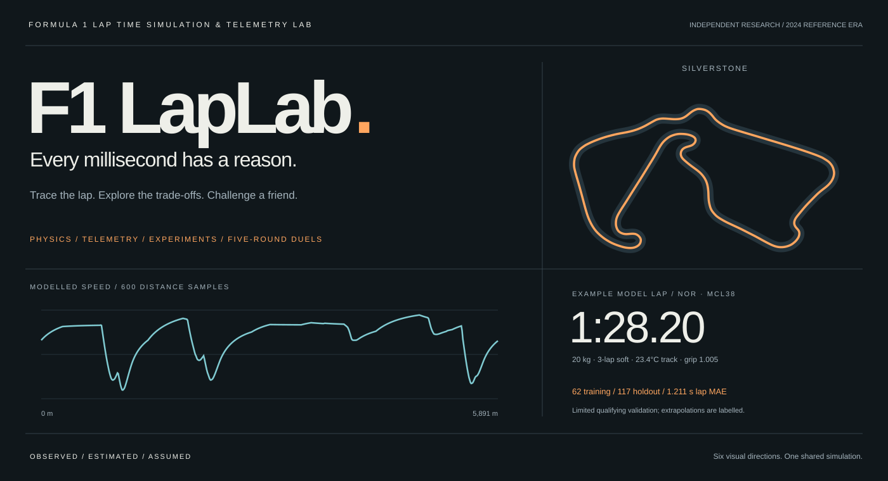
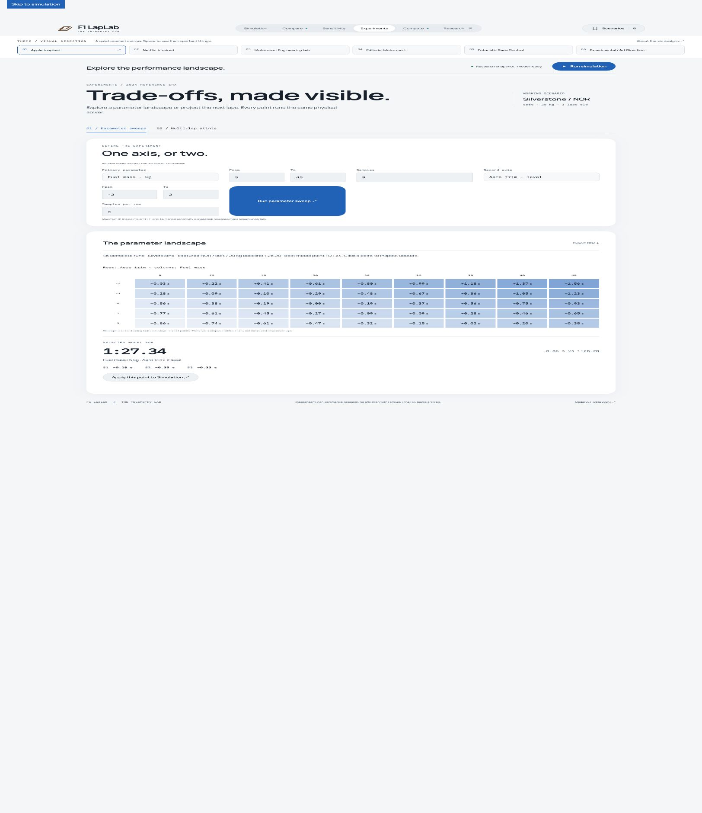
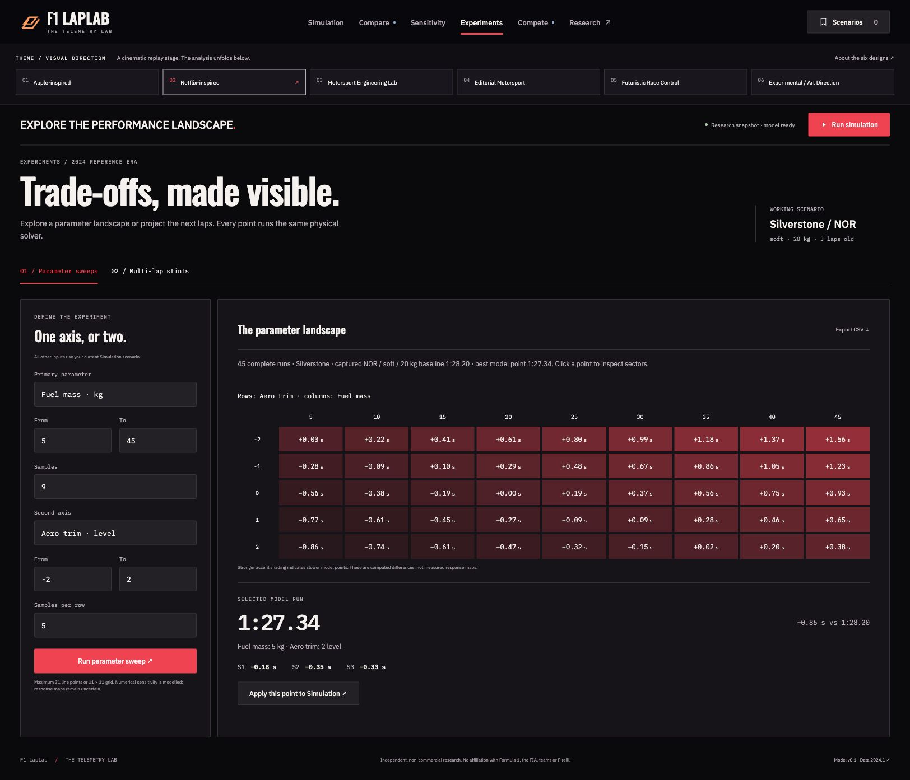
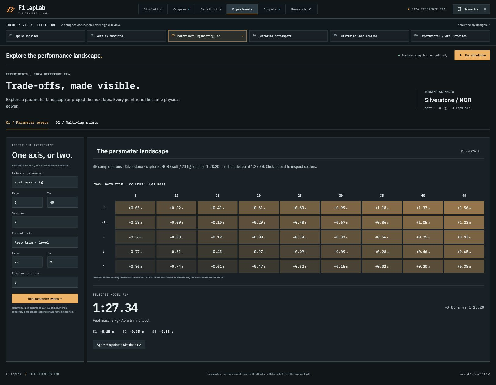
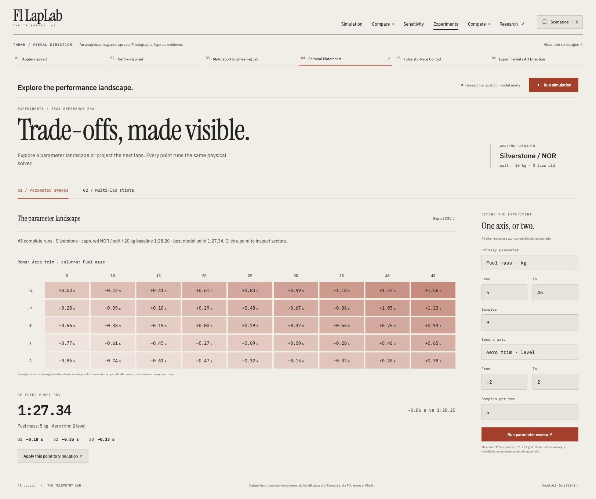
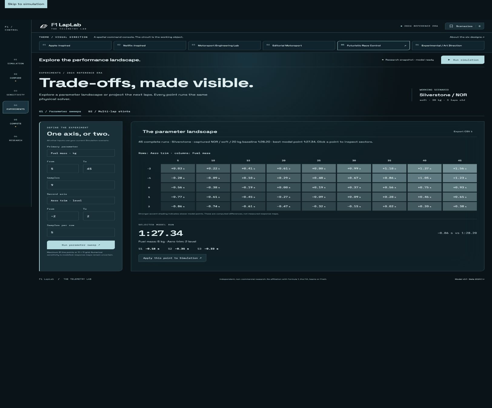
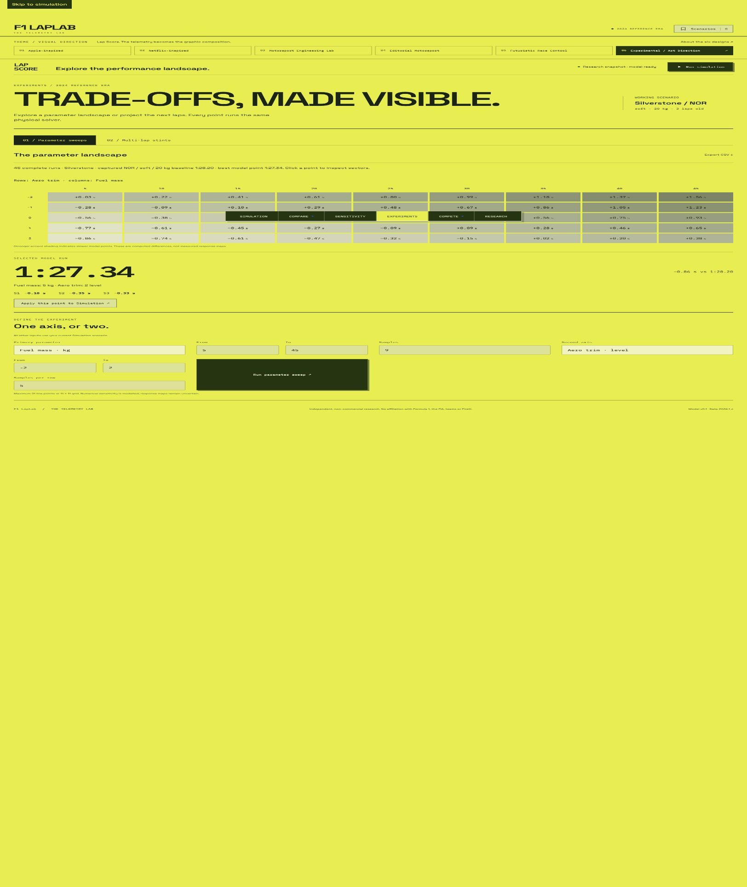
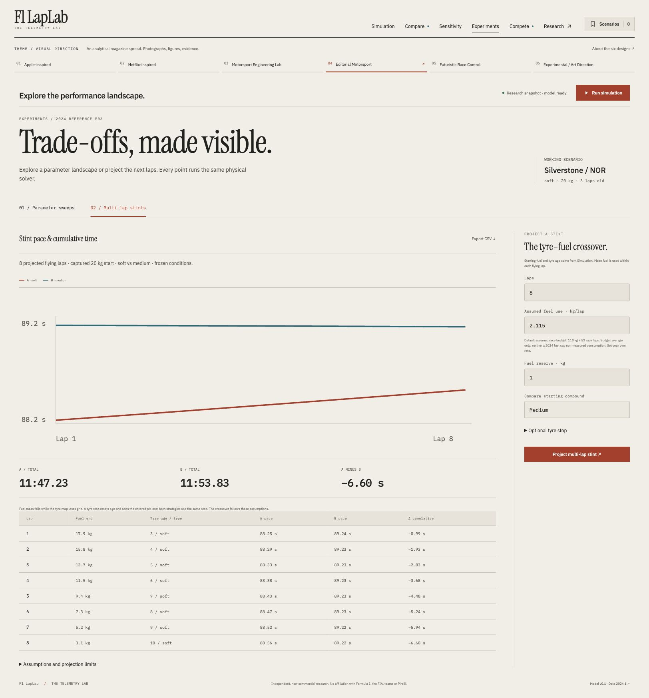
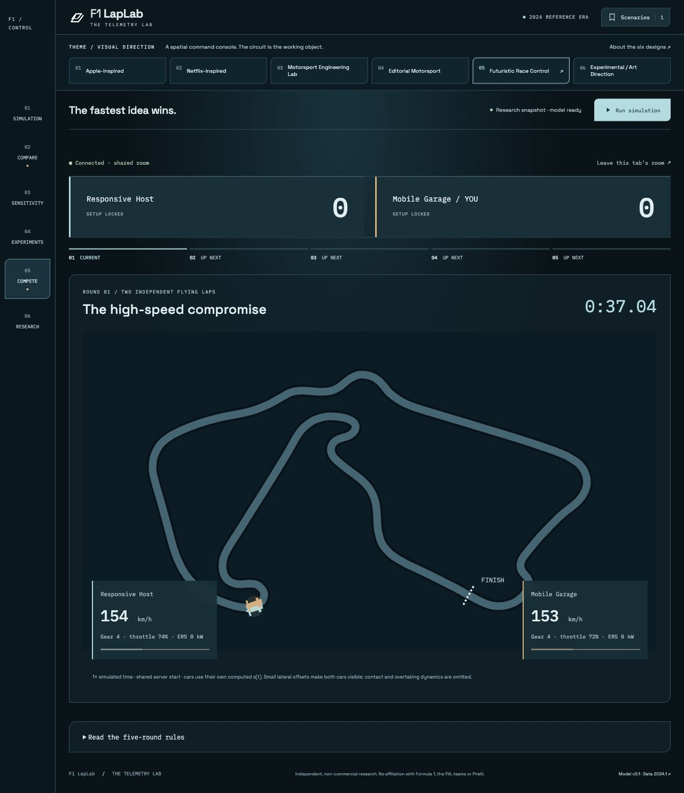
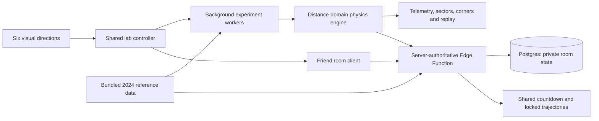

<div align="center">

# F1 LapLab

**Formula 1 Lap Time Simulation & Telemetry Lab**

Every millisecond has a reason.

[**Explore the live lab ↗**](https://f1-laplab.vercel.app) · [Methodology](docs/methodology.md) · [Setup duel rules](docs/multiplayer.md) · [Run locally](#run-locally)



</div>

A research-driven engineering playground: change a car's conditions, solve its lap, inspect the telemetry, then challenge a friend to find the faster setup. Six creative directions reinterpret the same product without changing its physics.

**2024 reference era.** Public telemetry anchors the model; proprietary vehicle parameters remain estimates. Independent, non-commercial research, with no affiliation with Formula 1, the FIA, teams or Pirelli.

## Inside the lab

| Experience | What it does |
| :--- | :--- |
| **Simulate** | Progressive acceleration, braking, cornering and traction around 600 distance intervals. Fuel, tyres, aero, air density, wind, ERS, DRS and calibrated driver/car residuals change the actual speed profile. |
| **Read the lap** | Synchronized circuit replay, speed/pedal/gear/ERS traces, sector splits and corner sections. Scrub the track or telemetry; export generated channels. |
| **Explain the difference** | Same-circuit A/B comparisons, accumulated phase effects and ordered counterfactual contributions. |
| **Sweep parameters** | One-axis curves or two-axis heatmaps, up to 121 complete solver runs. Inspect sector deltas, apply a point to Simulation, export CSV. |
| **Inspect coverage** | Matched training/holdout counts and observed temperature/age ranges. Reference domain, extrapolating or exploratory; no invented accuracy percentage. |
| **Project a stint** | Fuel falls and tyre age rises lap by lap. Compare compounds; optionally replace tyres with an explicitly assumed pit loss. Export every lap. |
| **Compete with a friend** | Private two-player rooms, three difficulties and five rounds. Server-validated setups lock, a shared countdown starts, and both cars follow their computed trajectories in real time. The winner appears at the finish. |
| **Change the lens** | Apple-inspired, Netflix-inspired, Motorsport Engineering Lab, Editorial Motorsport, Futuristic Race Control and Experimental / Art Direction. Different composition, density, navigation, imagery and chart treatment; identical simulation. |

<details>
<summary><strong>Six creative directions · the same 45-run experiment</strong></summary>

<table>
<tr><td width="50%"><strong>01 / Apple-inspired</strong><br></td><td width="50%"><strong>02 / Netflix-inspired</strong><br></td></tr>
<tr><td><strong>03 / Engineering Lab</strong><br></td><td><strong>04 / Editorial Motorsport</strong><br></td></tr>
<tr><td><strong>05 / Futuristic Race Control</strong><br></td><td><strong>06 / Experimental Art Direction</strong><br></td></tr>
</table>

</details>

### A performance landscape, not a mystery score


### Pace across a stint



### Five briefs. Two garages. One shared finish line.



Each round fixes the circuit, car, driver, fuel, tyres and weather. Optimize the allowed setup variables under a stated budget. Most round points wins; all five rounds run. Ties share a point, with total lap time breaking a tied match. [Complete rules and architecture →](docs/multiplayer.md)

## Evidence before confidence

| Domain | Coverage |
| :--- | :--- |
| Circuits | Silverstone, Monza, Monaco, Bahrain |
| Drivers | VER, PER, NOR, PIA, LEC, SAI, HAM, RUS |
| Cars | RB20, MCL38, SF-24, W15 |
| Calibration | 62 earlier soft-tyre qualifying laps |
| Chronological holdout | 117 later matched laps |
| Aggregate lap MAE | 1.211 s, with a slower-prediction bias |

**Observed / regulated** quantities, **calibrated estimates**, and **assumed responses** have separate labels. The held-out result covers a limited qualifying domain. It does **not** validate every slider, wet behaviour, multi-lap stints or game challenge conditions.

Fuel and exact setup/battery state are unobserved. Compound, degradation, thermal, wing and wake maps are assumptions. Driver residuals are modest, teammate-centred and confounded by car/setup/conditions; they are not personality ratings. Surveyed elevation/camber, detailed suspension, tyre pressure, transient tyre temperatures, MGU-H and 2026 rules are omitted.

Stints use mean fuel per flying lap and the declared wear map. Each lap starts with a full 4 MJ store; continuous battery carryover is **not** modelled. Pit loss and kg/lap fuel use are editable assumptions. The default illustrative 110 kg race budget divided by published race laps is not observed consumption or a claimed 2024 fuel cap. [Experiment methodology →](docs/experiments.md)

## Run locally

Node.js 18+ is sufficient for the static lab and tests; Node.js 22+ is recommended. No frontend dependencies, installation or build step are required.

```sh
npm start
# Open http://127.0.0.1:4173

npm test
```

The static site is in `dist/`. A bundled dataset and service worker keep experiments available when historical APIs fail. Live rooms require the configured Supabase backend and network access; failure is shown explicitly instead of silently using local-only rooms.

### Hosting

`vercel.json` serves `dist/` with no build/install step. Multiplayer uses a Supabase Edge Function and Postgres, separate from the frontend. `dist/rooms-config.mjs` contains only its public URL/key. **Never put service-role credentials in the frontend or repository.** [Backend setup and operations →](docs/deployment.md)

## Architecture



| Module | Responsibility |
| :--- | :--- |
| `dist/engine.mjs` | DOM-independent SI-unit flying-lap solver and comparisons |
| `dist/lab.mjs` | Bounded sweeps, training-derived coverage, fuel/tyre stint accounting |
| `dist/game.mjs` | Shared requirements, tests, locks, scoring and finish reveal |
| `backend/rooms.mjs` | Capability authentication, validation, rate limits, concurrency |
| `backend/schema.sql` | Server-only RLS tables and atomic compare-and-swap / rate RPCs |
| `dist/themes.mjs` | Presentation adapter preserving original controls and results |

Tests cover physics/data contracts, sweeps, stint accounting, coverage, room access, simultaneous locks, retries, stale rounds, finish timing and all five rounds. Browser checks cover computed results, responsive layouts and shared rooms. [Verification record →](research/extension-verification.md)

## Research, reuse and contributions

[Physics research](research/physics-research.md) · [Extension research](research/extension-research.md) · [Visual directions](research/theme-directions.md) · [Detailed methodology](docs/methodology.md) · [Attribution](docs/attribution.md)

The prepared snapshot retains provenance. Download/preparation/calibration tools are in `tools/`; original API inputs can be retrieved again subject to availability and rate limits. Preserve the chronological holdout and evidence labels. Better measurements should replace assumptions rather than add unsupported controls.

Source code is MIT licensed. Telemetry-derived data is separately **CC BY-NC-SA 4.0**; fonts are SIL OFL and archive photographs by Jen Ross are CC BY 2.0. Included credits/notices remain. MIT does not relicense third-party data, images, fonts, marks or regulations.
